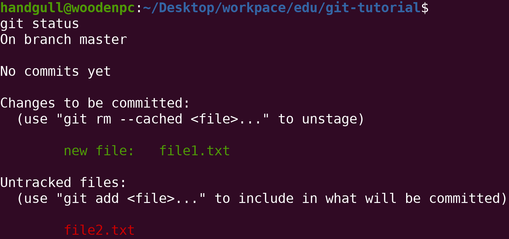

# Hello Git: Workflow di base

Git è un software che permette di **tenere traccia** dei cambiamenti fatti su un progetto nel tempo. Git ricorda ogni modifica, tenendone traccia e dando la possibilità di **accedere ad ogni versione** salvata del progetto.

## i 3 stadi di un progetto git

Possiamo semplificare (di molto) il workflow di git dividendolo in 3 parti:
1. Effettuo delle modifiche al progetto (aggiunta/rimozione/modifica di files).
2. Aggiungo le modifiche alla lista di modifiche pronte per essere "committate" (detta **Staging Area**)
3. Salvo i cambiamenti in una **commit**, le commit vengono conservate nella **Git repository**


> NOTA: la **Working Directory** è quindi la directory del progetto nello stato attuale
```sh
$ git init # init = initialize, inizializza tutti gli strumenti necessari al versioning (nella cartella .git)
$ git status # Visualizza lo stato del branch
$ git add <filename> # Aggiunge le modifiche relative al file/ai file alla staging area sopra citata
$ git add <filename> <otherFilename> ... # Posso specificare anche più di un file alla volta
$ git add -A # Aggiunge tutte le modifiche pendenti alla staging area
$ git commit -m"<comment>" # Salva permanentemente come commit le modifiche
$ git commit --amend -m"<comment>" # Sovrascrive l'ultima commit effettuata, utile per mantenere la history pulita e chiara in caso di piccole sviste
```

> **Convenzioni riguardanti i commenti**:<br>
> - Dovrebbero essere in [Present Tense](https://learnenglish.britishcouncil.org/english-grammar-reference/present-tense)
> - Non dovrebbero superare i **50 caratteri**



:::tip
I files in verde sono gli **staged files**, quelli rossi sono quelli in attesa di essere aggiunti alla staging area
:::

## git diff: vedere le modifiche effettuate

Git ci permette di vedere le **differenze** tra i files della working directory e la staging area (molti editor/IDE supportano Git e forniscono uno strumento grafico per vedere questo, naturalmente essi si appoggiano al comando fornito da git).
```sh
$ git diff <filename> # Visualizza la lista dei cambiamenti di un file rispetto alla staging area
```


## git log & git blame: lo storico

Le commit possono essere viste grazie ad uno **storico** (come vedremo, lo storico può essere sia locale che remoto).<br>
È inoltre possibile per ogni riga di ogni file **sapere chi** (ed in quale commit) ha effettuato l'ultimo cambiamento a quella riga.

```sh
$ git blame <filename> # Stampa ogni riga del file, con hash autore e data dell'ultima commit che ha avuto a che fare con quella riga
$ git log # Stampa a video lo storico delle commit
$ git log --pretty=oneline # Stampa le commit in formato abbreviato, facendo occupare una sola riga per commit
$ git log --graph # Stampa a terminale le commit con un grafo che fa capire lo stato dei vari branch
```

Screenshot di una sezione dello storico in modalità grafo:


:::tip
In arancione possiamo vedere un codice alfanumerico di 40 caratteri, questo è l'**hash** o **SHA** della commit e viene usato come identificativo per riferirsi alla commit.
:::

[git log ed i branch](./branching#parentesi-riguardo-git-log)
